# FF14 Discord Notify (KR)

FF14 한국서버 ACT + Triggernometry 기반 Discord 알림 트리거

파티 모집 중 자리를 비워도 디스코드로 파티 상태를 확인할 수 있습니다.

## 기능

| 기능 | 설명 |
|------|------|
| 듀티 매칭 | 임무 신청 시 Discord 알림 |
| 파티원 참가 | 파티에 사람이 들어오면 알림 (`이름@서버` 형식) |
| 파티원 퇴장 | 파티에서 사람이 나가면 알림 (`이름@서버` 형식) |
| 파티 해체 | 서버 내 / 서버 초월 파티 해체 시 알림 |
| 파티 채팅 전달 | 파티챗 내용을 Discord로 전달 (`이름@서버: 메시지` 형식) |

> 같은 서버 파티원은 `이름`, 다른 서버 파티원은 `이름@서버` 형식으로 표시됩니다.

## 필요 사항

- [Advanced Combat Tracker (ACT)](https://advancedcombattracker.com/)
- FFXIV ACT Plugin (한국서버용)
- [Triggernometry](https://github.com/paissaheavyindustries/Triggernometry)
- Discord Webhook URL


## 설치 방법

### 1. Discord Webhook 생성

알림을 받을 Discord 채널에 Webhook을 만듭니다.

채널 옆 **톱니바퀴**(채널 편집)를 클릭합니다.

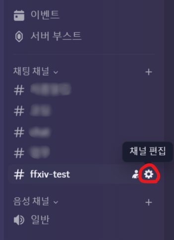

**연동** 탭에서 **웹후크**를 클릭합니다.

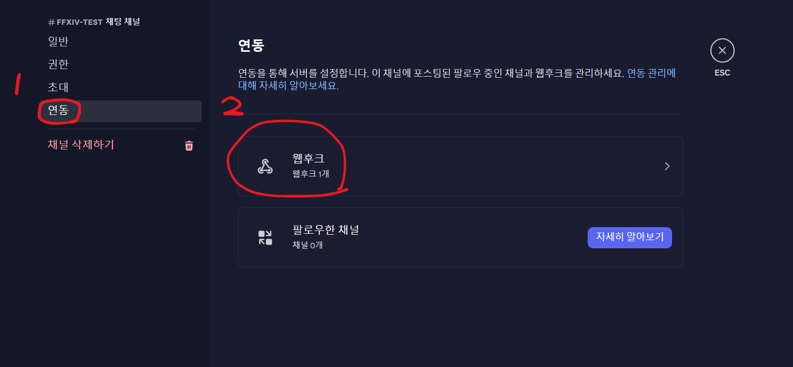

**새 웹후크**를 클릭하여 웹후크를 생성합니다.

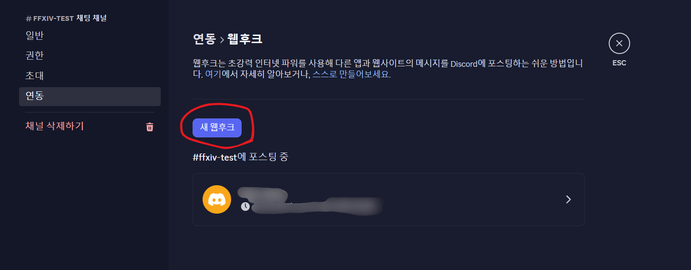

웹후크 이름을 설정하고, **웹후크 URL 복사**를 클릭한 뒤 **변경사항 저장하기**를 누릅니다.

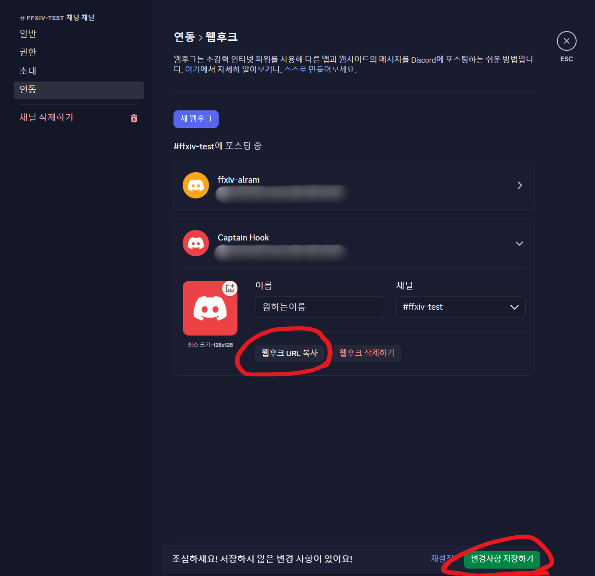

### 2. Triggernometry에 Import

ACT를 실행하고 **Plugins** 탭을 클릭합니다.

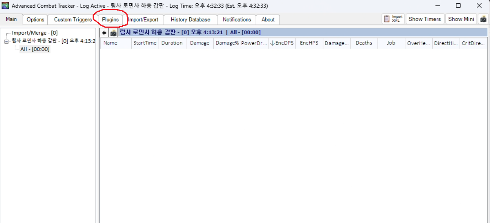

**Triggernometry** 탭을 클릭합니다.

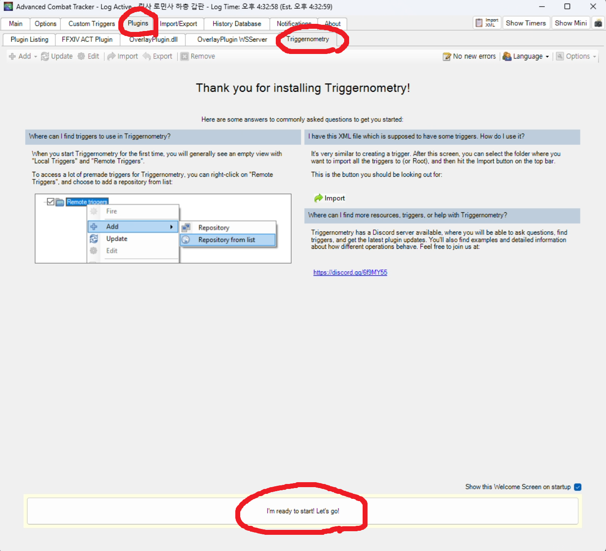

상단의 **Import** 버튼을 클릭합니다.

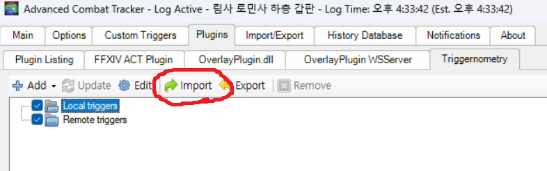

**Load from file or URI**를 선택하고, `FF14_Discord_Notify_Portable.xml` 파일 경로를 지정한 뒤 **Next**를 클릭합니다.

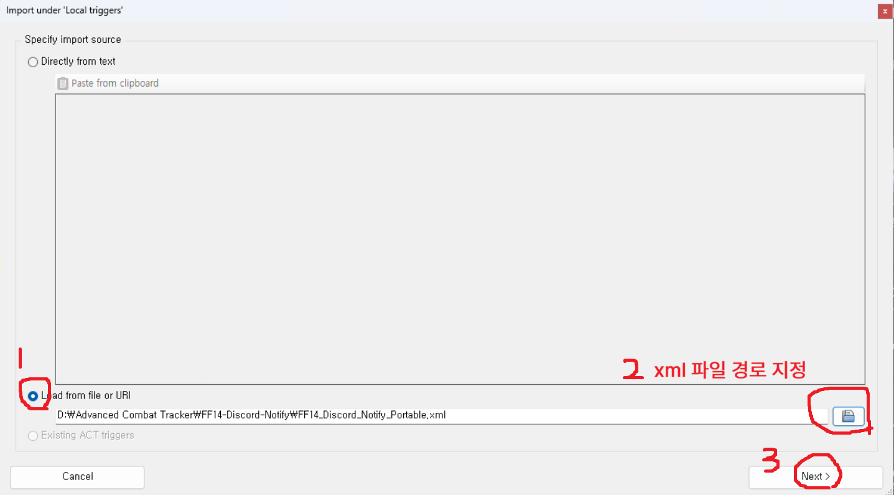

트리거 구조를 확인하고 **Import**를 클릭합니다.

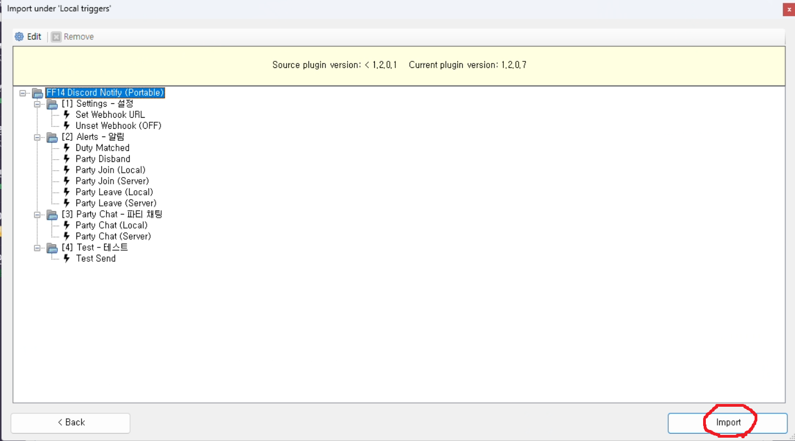

Import가 완료되면 트리거 목록에 `FF14 Discord Notify (Portable)` 폴더가 생성됩니다.

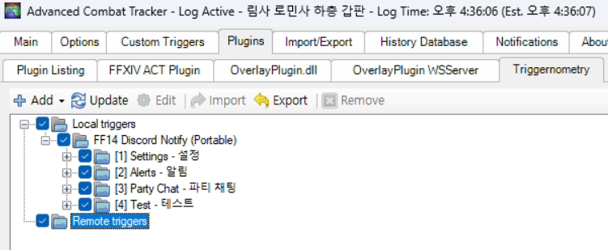

### 3. Webhook URL 설정

게임 내 채팅창에 아래와 같이 입력합니다. (복사한 Webhook URL을 붙여넣기)

```
/e !notify_set https://discord.com/api/webhooks/YOUR_WEBHOOK_URL
```

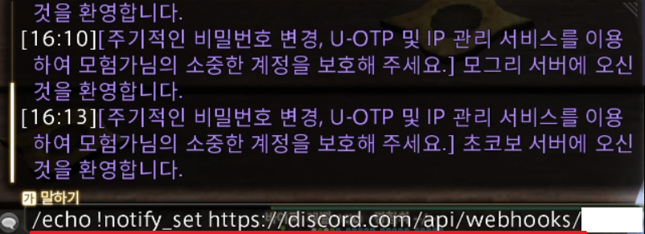

Discord에 `Webhook Linked!` 메시지가 오면 성공입니다!

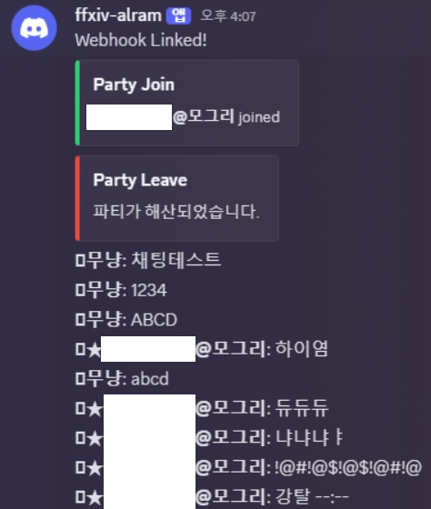

### Webhook 해제

```
/e !notify_off
```

### 테스트

```
/e !ff14notify_test
```

Discord에 `Webhook OK!` 메시지가 오면 정상 작동 중입니다.

## 약간의 팁

인게임 매크로에
/echo notify_set {웹후크주소}

/echo notify_unset 
각각 만들어두면 편하게 사용 가능

## 알려진 제한사항

- **한국서버 전용** (ACT 한국서버 플러그인 기반)
- 다른 파티원의 직업명 표시 불가 (ACT 한국서버 플러그인의 메모리 읽기 제한)

## 문제 해결

| 문제 | 해결 |
|------|------|
| Webhook 연결이 안 됨 | URL이 `https://discord.com/api/webhooks/`로 시작하는지 확인 |
| `/e !ff14notify_test` 반응 없음 | Triggernometry에 트리거가 Import되었는지 확인, 폴더가 Enabled 상태인지 확인 |
| 파티챗이 안 옴 | ACT 로그에서 파티챗의 채널코드가 `000E`인지 확인 |

## 주의사항

- ACT 및 플러그인 사용은 FF14 이용약관의 그레이존입니다
- 본 트리거 사용으로 인한 불이익은 사용자 본인 책임입니다
- Discord Webhook URL은 개인 정보이므로 공개하지 마세요

## 라이선스

MIT License
